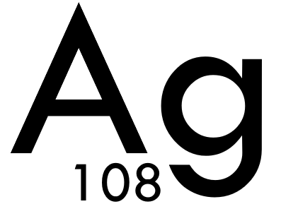

# Silver <small>0.1a</small>

> A simple class-based 3D game engine, in 100% C++.

* *Easy to use, simple 20 line setup.*
* *Small in size, and only 2 dependencies.*
* *Constantly updated with new features.*

[GitHub](https://github.com/c272/silver/)
[Quick Start](https://c272.github.io/silver/#/intro)